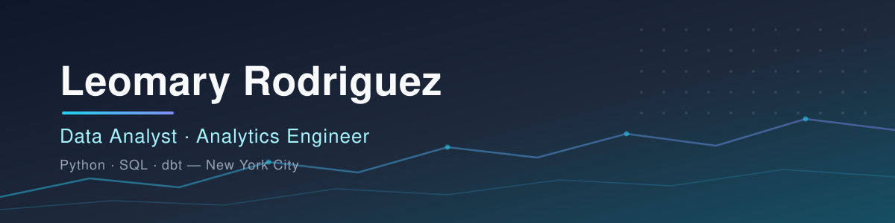

### Hi, I'm Leomary 👋

I spent years as a video producer, shaping stories for clients
like Nike and People Magazine, before moving into data and analytics
engineering. The medium changed; the throughline didn't. Whether it's a
30-second spot or a Snowflake model, the job is the same: take messy, human
information and turn it into something people can see, trust, and act on.
📍 New York, NY

## 🔍 Professional Background

* 🔭 Building various project models, apps and pipelines for organizations; specifically to ease community connection efforts
* 💼 Owning an end-to-end data ecosystems
* 🌱 Completing The Knowledge House Data Analytics Fellowship in 2026
* 💬 Ask me about survey data pipelines, config-driven dashboards, or getting non-technical teams to trust their data
* ✨ Fun Fact: I run for fun! 🏃🏽‍♀️‍➡️, sometimes with my dog Neo 🐾

## 🛠 Skills & Tools

**Analytics & Data**

**Visualization & BI**

**Engineering & Workflow**

## 📌 Featured Projects

### 🗺️ [Land and Water Protection Map](https://github.com/code-by-leo/Land_Water_Protection_Efforts)
Public interactive map of land and water protection movements — built end to end, from sourcing and modeling the data to shipping the map.

  

### 🚲 [Citibike Ridership Forecasting](https://github.com/code-by-leo/citibike-ridership-model)
Regression model predicting daily Citibike ride volume from calendar and weather features alone — feature engineering, model selection, and honest error analysis.

  

### 📺 [Community Media Contributor Analytics](https://github.com/code-by-leo/community-media-contributor-analytics)
Layered dbt project modeling four years of contributor and submission data from a public access TV station — staging → intermediate → mart models, schema and singular tests, and incremental materialization.

  

## 📫 Connect with Me

Thanks for stopping by — if you want to talk data, pipelines, or dashboards, reach out on
[LinkedIn](https://linkedin.com/in/leomary) or take a look at my
[resume](https://drive.google.com/file/d/1ZdbVo5DEXBa5CI2YDTcJzQNVyEoPO-8K/view?usp=sharing). 💡
